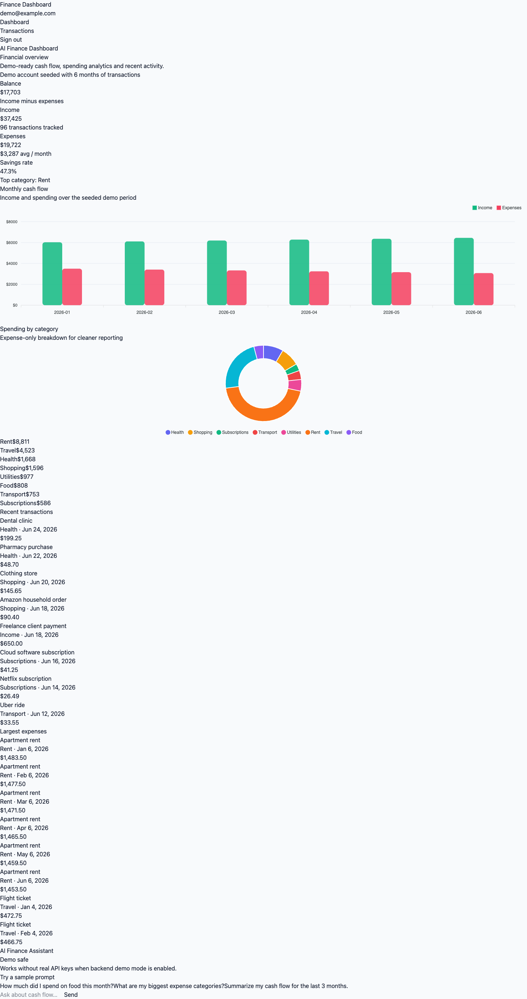
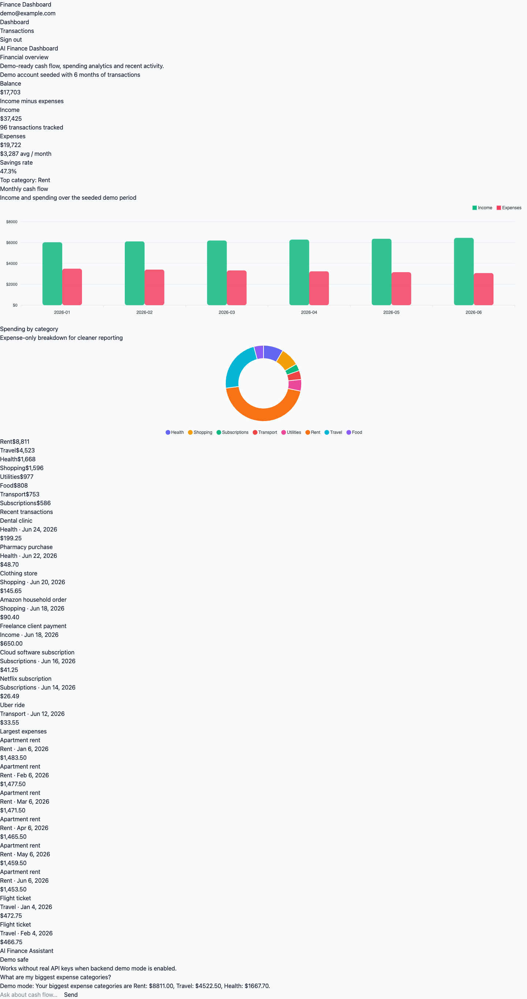
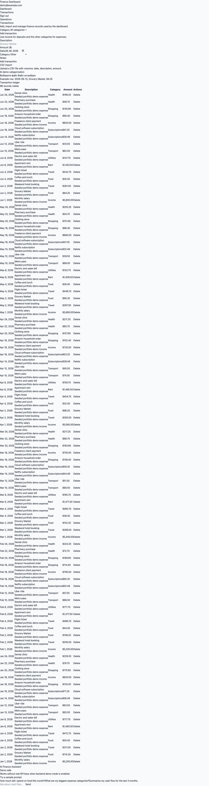
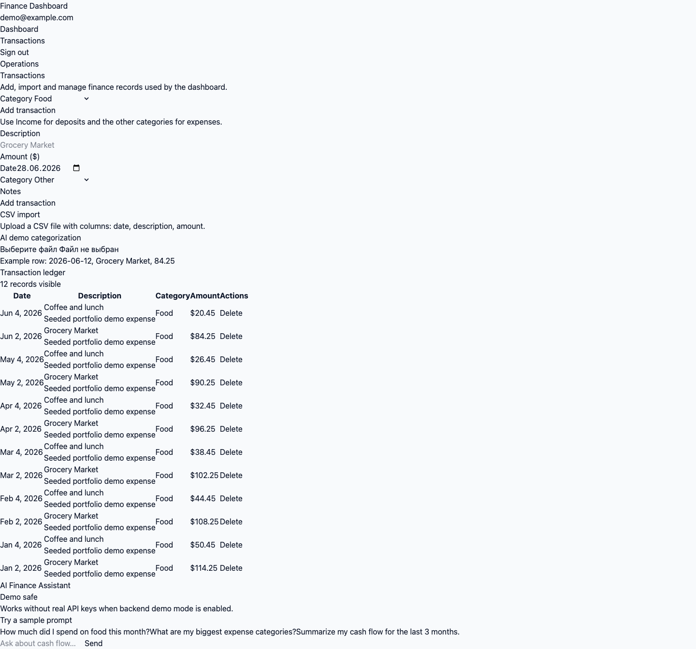

# AI Finance Dashboard & Reporting API

Angular dashboard for a portfolio-ready finance reporting tool. It presents seeded cash-flow analytics, transaction operations, CSV import, charts, and an AI assistant backed by a NestJS API.

## Portfolio Value

This project demonstrates full-stack dashboard development: API-backed data flows, transaction analytics, charts, CSV import, JWT auth, AI-assisted categorization, and clean reporting UX.

## Stack

- **Angular 21** with standalone components, Signals, functional guards, and interceptors
- **Tailwind CSS** for dense dashboard styling
- **ApexCharts** via `ng-apexcharts` for category and monthly trend charts
- **NestJS API** for auth, transactions, analytics, CSV import, and AI demo mode

## Features

- Dashboard KPI cards for balance, income, expenses, and savings rate
- Monthly income vs expense trend chart
- Spending by category donut chart and category table
- Recent transactions and largest expenses tables
- Transaction ledger with category filter and delete action
- Add transaction form with AI/demo category suggestion
- CSV import card for `date,description,amount` files
- AI assistant with sample prompts and keyless demo responses
- JWT login flow with seeded demo credentials

## Screenshots









## Demo Credentials

- Email: `demo@example.com`
- Password: `demo12345`

## Setup

Start the backend first. It should be available at `http://localhost:3001/api`.

```bash
npm install
npm start
```

Open [http://localhost:4200](http://localhost:4200).

The frontend API URL is configured in `src/environments/environment.ts`:

```ts
apiUrl: 'http://localhost:3001/api'
```

## Backend

Pairs with [finance-dashboard-api](https://github.com/K1ngp1nDev/finance-dashboard-api) (NestJS 11, PostgreSQL, Prisma, JWT, Swagger, AI demo mode).
