# AI Finance Dashboard

Angular dashboard for a portfolio-ready finance reporting tool. It presents seeded cash-flow analytics, transaction operations, CSV import, responsive desktop/mobile reporting views, light/dark themes, charts, and an AI assistant backed by a NestJS API.

## Portfolio Value

This project demonstrates full-stack dashboard development: API-backed data flows, transaction analytics, charts, CSV import, JWT auth, AI-assisted categorization, and clean reporting UX.

## Stack

- **Angular 21** with standalone components, Signals, functional guards, and interceptors
- **Tailwind CSS** with class-based light/dark theme support
- **ApexCharts** via `ng-apexcharts` for category and monthly trend charts
- **NestJS API** for auth, transactions, analytics, CSV import, and AI demo mode

## Features

- Dashboard KPI cards for balance, income, expenses, and savings rate
- Monthly income vs expense trend chart
- Spending by category donut chart and category table
- Responsive dashboard layout for desktop, tablet, and mobile screenshots
- Recent transactions and largest expenses tables
- Transaction ledger with desktop table, mobile cards, category filter, and delete action
- Add transaction form with AI/demo category suggestion
- CSV import card for `date,description,amount` files
- AI assistant visible on the dashboard with sample prompts and keyless demo responses
- **Reports** page — monthly cash-flow chart, income vs expense comparison, category-trend donut, largest expenses, CSV export, and an embedded context-aware AI assistant
- **Budgets** page — per-category budget vs spend progress bars, over-budget alerts, and an inline budget-edit modal
- **Subscriptions** page — recurring charges, upcoming renewals, cost-by-merchant chart, and mark-reviewed / cancel demo actions
- **Goals** page — savings goals with progress, forecast card, contribution history, and contribute demo actions
- **Categories** page — category breakdown with share bars, an AI categorization-rules view, and a rename/merge demo modal
- Persisted light/dark theme toggle for login, dashboard, AI assistant, and transactions
- JWT login flow with seeded demo credentials

## Screenshots

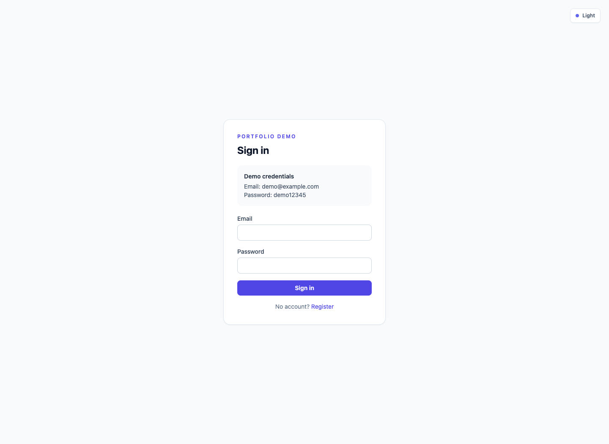

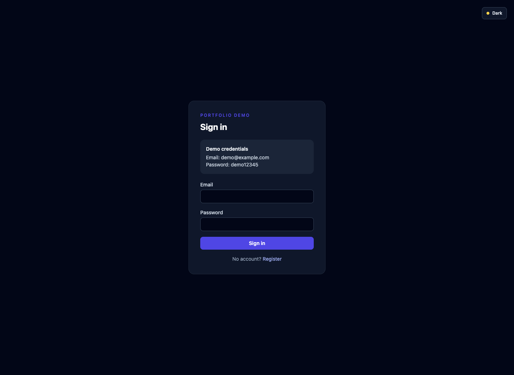

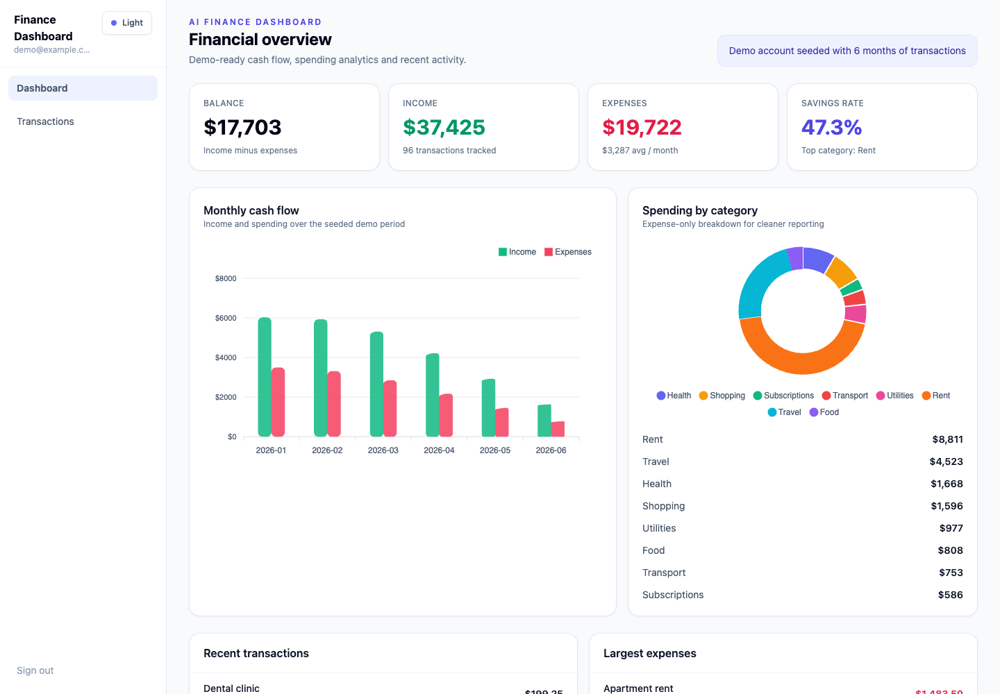

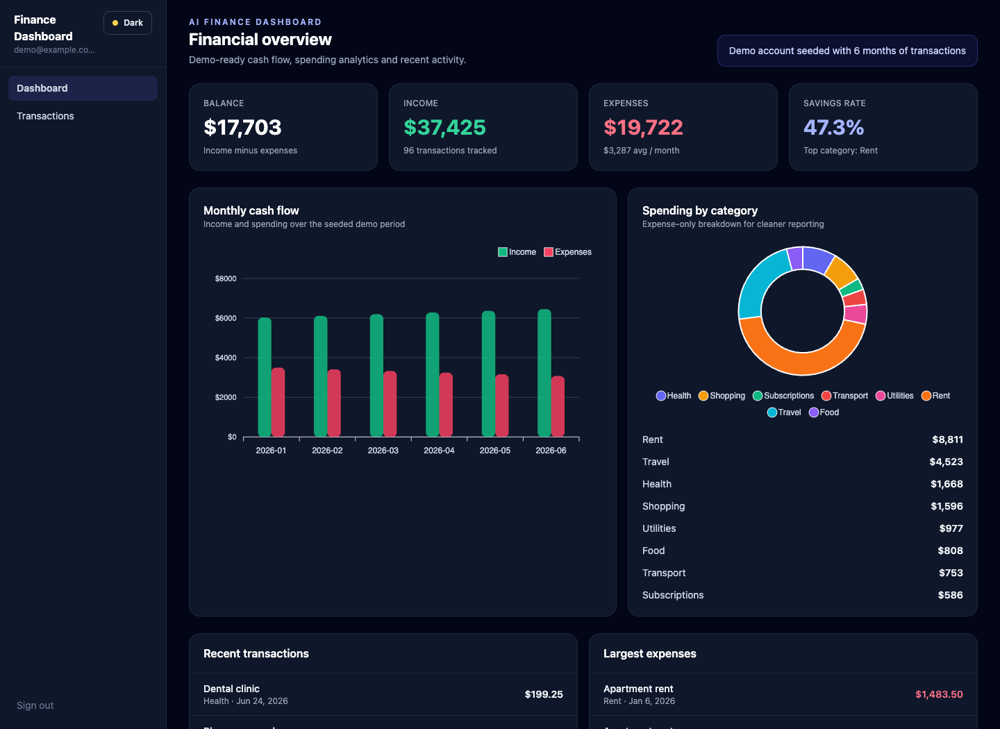

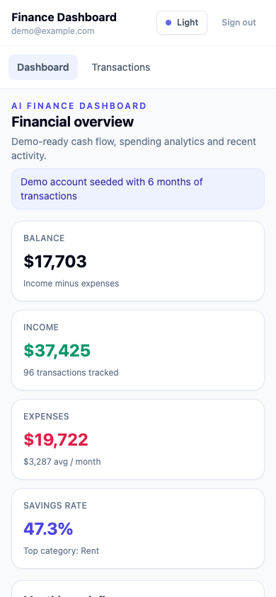

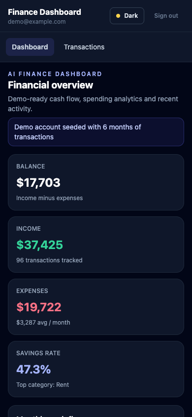


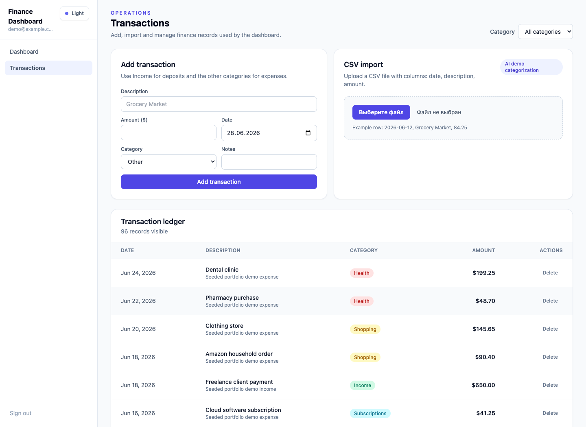

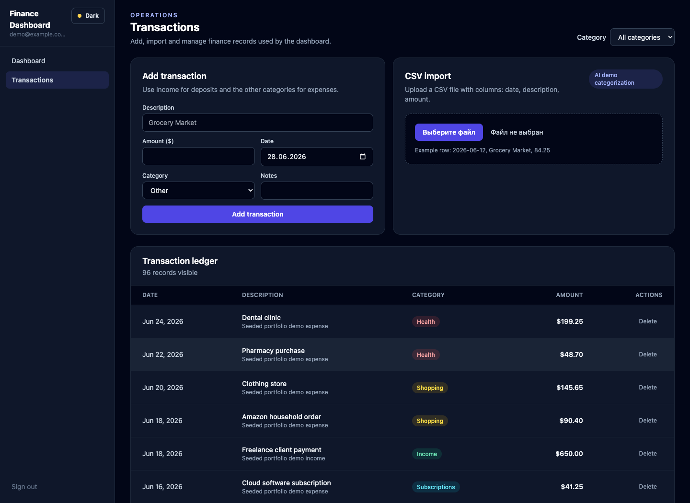

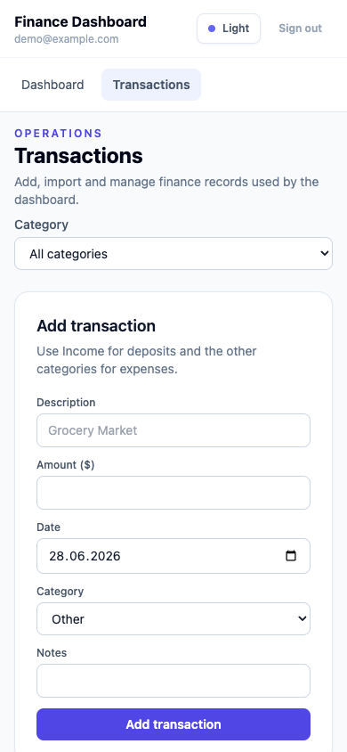

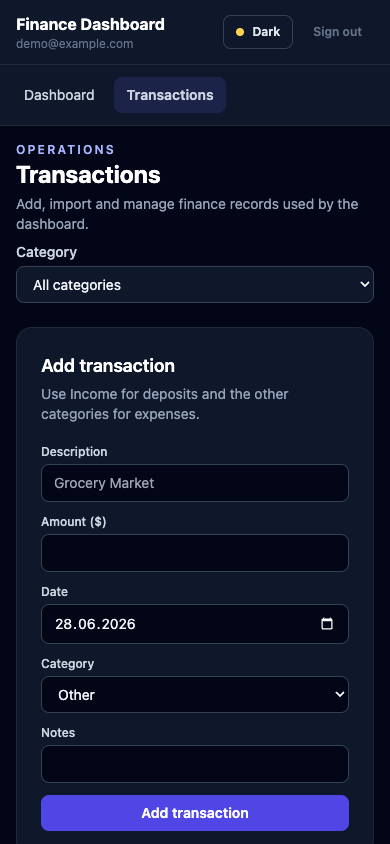


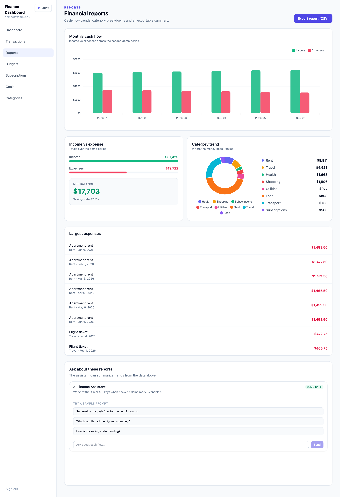

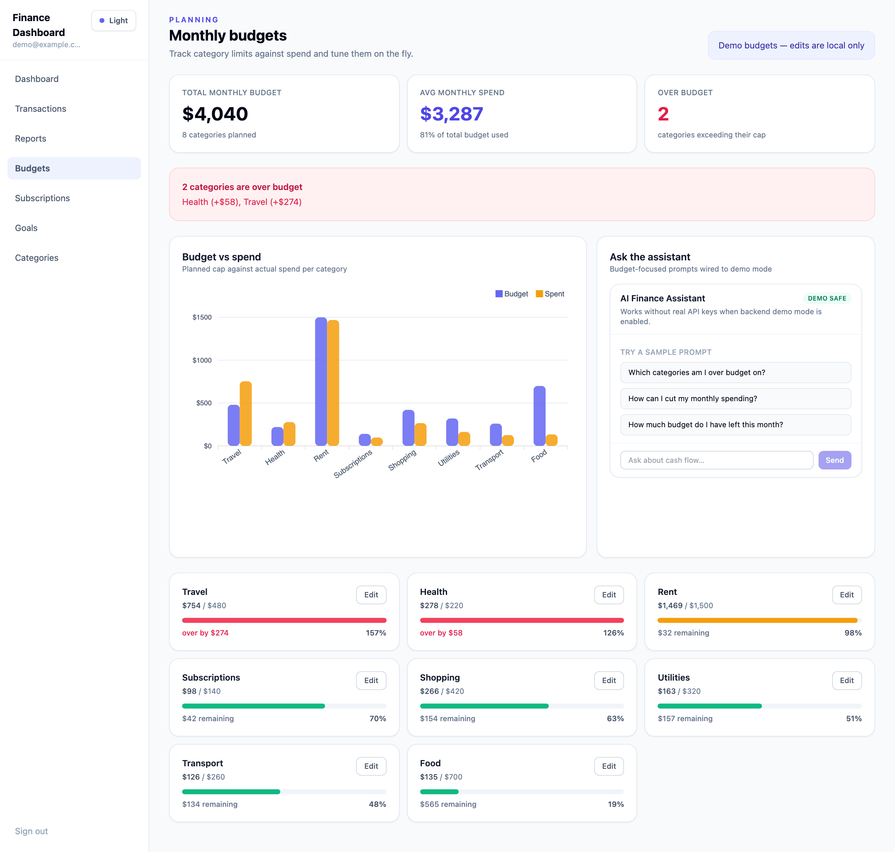

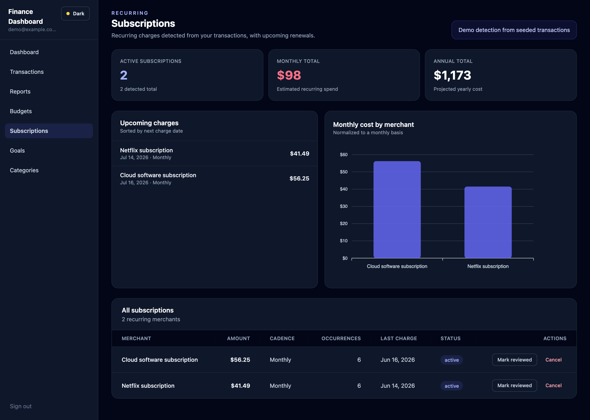

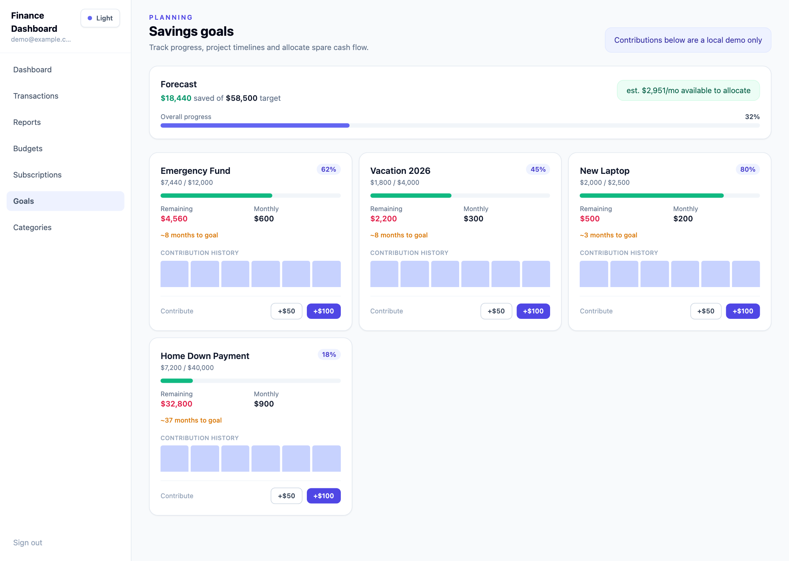

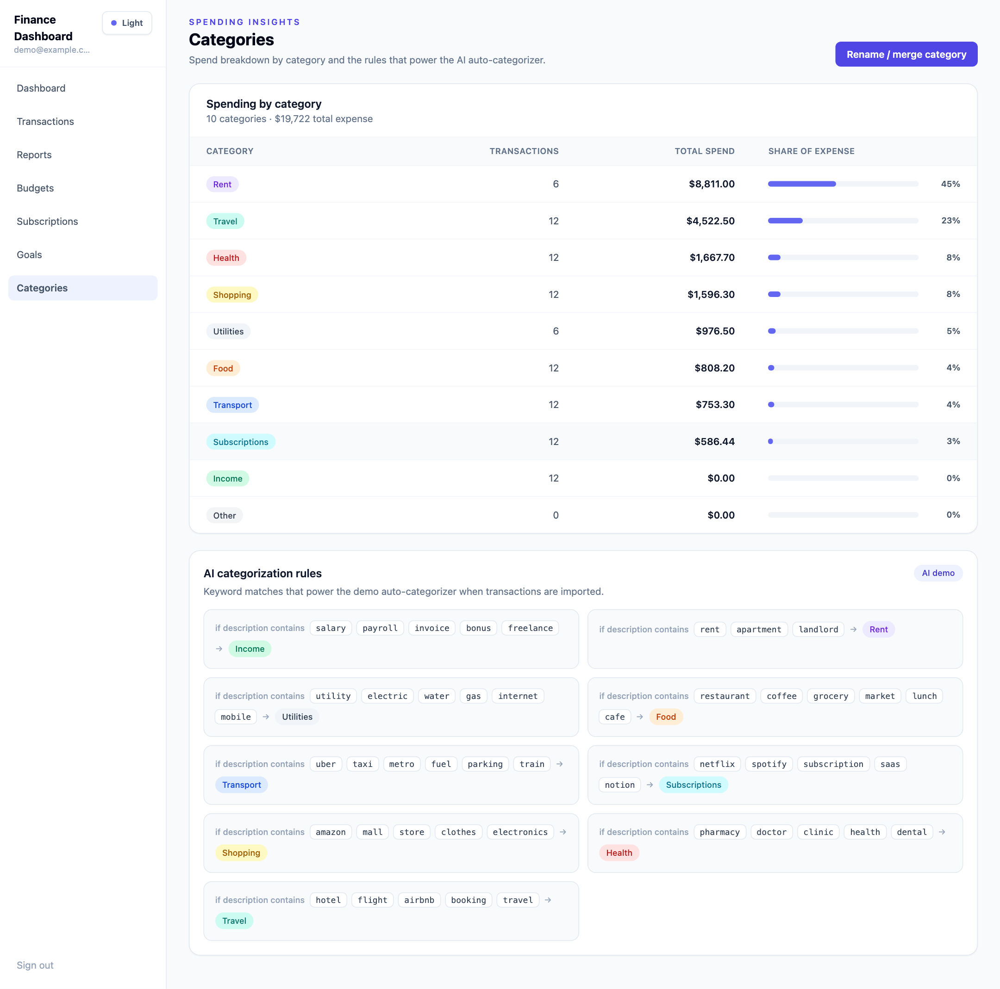

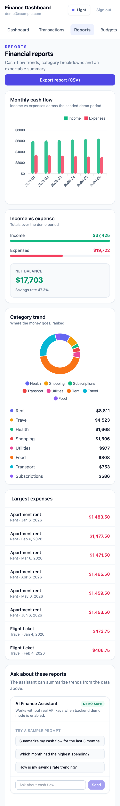

## Demo Credentials

- Email: `demo@example.com`
- Password: `demo12345`

## Setup

Start the backend first. It should be available at `http://localhost:3001/api`.

```bash
npm install
npm start
```

Open [http://localhost:4200](http://localhost:4200).

The frontend uses a same-origin API path, so it works cleanly behind a reverse proxy:

```ts
apiUrl: '/api'
```

During local development, `npm start` uses `proxy.conf.json` to forward `/api/*` to
the NestJS API on port `3001`.

## Backend

Pairs with [finance-dashboard-api](https://github.com/K1ngp1nDev/finance-dashboard-api) (NestJS 11, PostgreSQL, Prisma, JWT, Swagger, AI demo mode).

## Production Demo Run

For a future live demo, run the frontend as a static production build rather than the Angular dev server:

```bash
npm install
npm run build
npx serve dist/finance-dashboard-frontend/browser
```

Run the backend with `AI_DEMO_MODE=true`, apply migrations, seed the demo database, then start the production server:

```bash
npm install
npx prisma generate
npx prisma migrate deploy
npm run db:seed
npm run build
AI_DEMO_MODE=true npm run start:prod
```

The demo UI intentionally avoids contact details, external hire CTAs, Telegram, LinkedIn, or personal email links.
